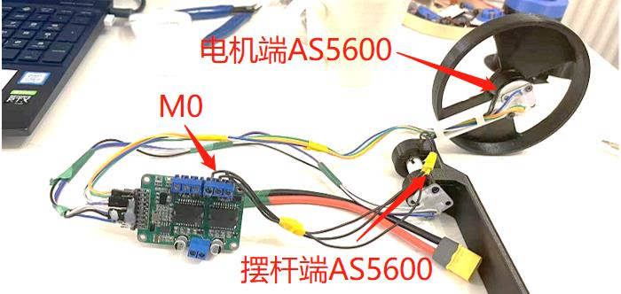
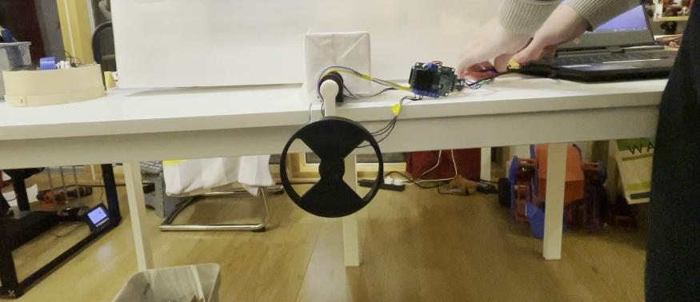
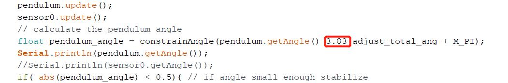

# DengFOC动量轮倒立摆项目
**DengFOC动量轮倒立摆**是基于SimpleFOC官方开源的[动量轮倒立摆项目](https://github.com/simplefoc/Arduino-FOC-reaction-wheel-inverted-pendulum)，低成本化和小型化后应用在我开源的[DengFOC](https://github.com/ToanTech/Deng-s-foc-controller)双路无刷电机驱动器上的DengFOC配套项目。

**项目完全开源，你可以根据本Github内容自行白嫖，或者，支持一下灯哥的辛勤劳作，进入灯哥开源TB店购买DengFOC动量轮倒立摆套件，一键配齐。**

[DengFOC动量轮倒立摆套件--链接猛击](https://m.tb.cn/h.fmqh3g3?tk=4y0R2f0qtv4)

## 1 视频教程

配套本开源项目，灯哥精心制作了全组装过程视频教程，请点击查看：

[1 DengFOC动量轮倒立摆--效果展示和机械组装](https://www.bilibili.com/video/BV1SU4y1Z72W/)

[2 DengFOC LQR无刷动量轮倒立摆算法原理和DIY实现](https://www.bilibili.com/video/BV1JL4y177Z5/)

## 2 接线

只要你手头有一块DengFOC V3（你可以在TB搜索**灯哥开源**进入店铺购买，或根据[DengFOC开源仓库](https://github.com/ToanTech/Deng-s-foc-controller)的开源资料自制）就可以快速搭接出此项目，项目供电默认电压为16.8V，除DengFOC外，其它电子元器件主要由一个2204无刷电机，两个as5600编码器组成。其接线表格如下：

| 零件         | 接线位置          |
| ------------ | ----------------- |
| 2204电机     | DengFOC M0位置    |
| 电机端AS5600 | SDA0,SCL0,3V3,GND |
| 摆杆端AS5600 | SDA1,SCL1,3V3,GND |

## 3 零件制造

倒立摆的主要零件为3D打印，下载文件夹中的图纸，全100%密度打印即可。

其它零件全部可以在开源文件夹中的"bom表"找到。

## 4 下载程序

下载项目文件夹中的DengFOC_Inverted_Pendulum.ino程序，用Arduino IDE打开，用串口连接DengFOC，即可按照与一般Arduino一致的方法上传。

## 5 调试

### 5.1 初值指定

完成下载程序后，需要对动量轮倒立摆的初始角度进行标定。标定前，首先确保倒立摆处于下垂状态，如图所示：

接着，注释掉程序中的语句，以确保上电电机不会运动：

`motor.move(target_voltage);`

完成注释后，对DengFOC控制器上电，并按下板子上的“复位”按钮，在电机校准后，Arduino IDE的串口调试器会输出一连串的数值，这就是我们需要的倒立摆初始角度，记录下这个角度，替换掉如图所示的数字3.83：

完成替换后，取消motor.move(target_voltage);这一句代码的注释，使得电机能够运动，重新上传程序，并上电复位，此时倒立摆应该就能正常运转。

### 5.2 LQR参数整定

一般情况下，**LQR控制器的三个参数(即 adjust_ang、 adjust_p_vel 、 adjust_motor_vel)是不需要调节的**，只需要采用和我一样的电机，按照我的打印密度打印零部件，就不需要调整这三个参数。然而，如果你更换电机，亦或者动量轮的打印密度和我的不一样，那么你需要重新调节这三个参数，才能实现稳定。

由于我在程序里做了串口快速调节的部分，因此调节的方法非常简单，下面是调节方法：

**(1)如果你需要调节倒立摆角度稳定的LQR参数：**

在Arduino IDE的串口监视器中输入："A+参数 "即可，如把参数调节到"40"则输入A40

**(2)如果你需要调节倒立摆角速度的LQR参数：**

在Arduino IDE的串口监视器中输入："P+参数 "即可，如把参数调节到"5"则输入P5

**(3)如果你需要调节倒立摆电机速度的LQR参数：**

在Arduino IDE的串口监视器中输入："M+参数 "即可，如把参数调节到"0.01"则输入M0.01

## 6 其它注意事项

如果更换为其他电机，需要重新设置电机极对数

如果自稳效果与倾倒方向相反，证明电机三相线接反，导致电机转向接反，调换三相线中其中两根即可